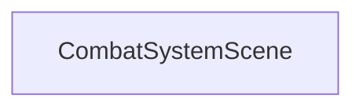
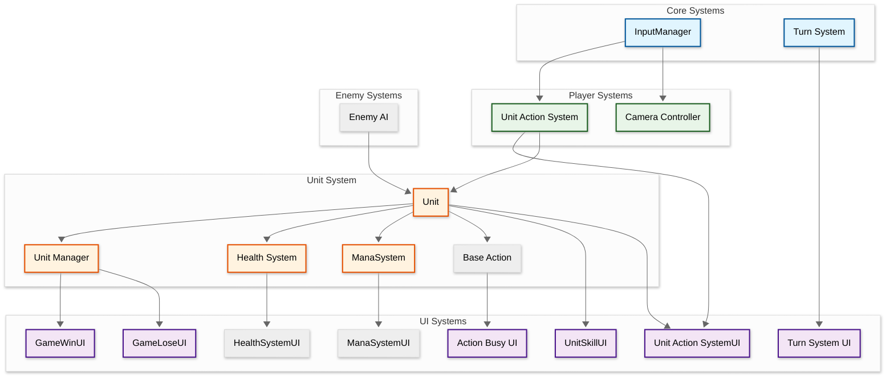
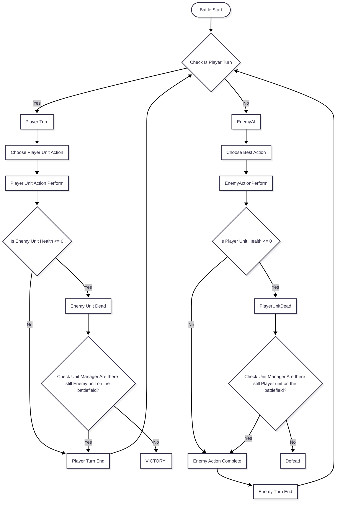
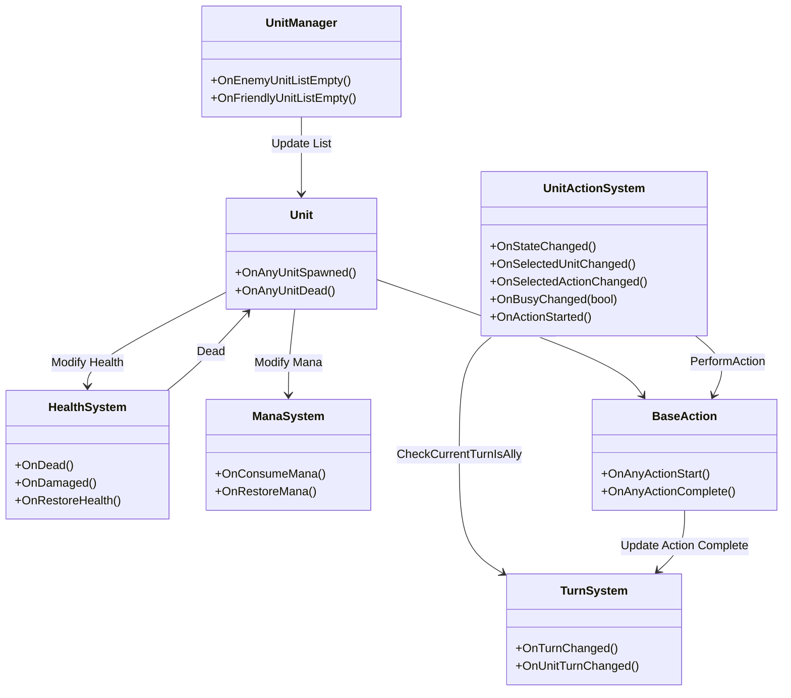

  
   

## Developer & Contributions
**Evan Jonathan** (Game Programmer)  

## About
A personal project focused on developing a turn-based RPG battle system inspired by the Persona series. The project features character skills, turn management, and combat mechanics designed to recreate the feel of JRPG battles.

 

 

## Key Features

• Turn-Based Combat System  
• Skill System  
• Turn Order Management  
• Character Statistics  
• Battle State Machine  
• Enemy AI 

<table>
<tr>
<td align="center" width="50%">
<strong>RPG Turn-based Combat System</strong> 

</td>
</tr>
</table>

## Scene Flow

## Layer / Module Design

## Modules and Features

The 3D RPG turn-based Combat gameplay with Persona-inspired GridSystem,TurnSystem, EnemyAI, and HealthSystem is powered by an extensive Unity C# scripting system.

|  📂 Name     | 🎬 Scene |  📋 Responsibility                                                 |
| ------------------- |----------------| ------------------------------------------------------------ |
| `TurnSystem` | CombatSystemScene |Manages unit turns and battle flow|
| `UnitManager` | CombatSystemScene |Manages all units on the battlefield|
| `BaseAction` | CombatSystemScene |Abstract base class for all unit actions|
|  `Unit.cs` | CombatSystemScene | Stores unit data and handles combat actions|
| `UnitAnimator.cs`  | CombatSystemScene |Handles unit animations and visual effects |
| `UnitActionSystem.cs`  | CombatSystemScene |Manages player input and unit actions during battle |
| `CameraManager.cs`| CombatSystemScene | Manages camera movement and positioning |
| `InputManager.cs`| CombatSystemScene | Handles player input |
| `EnemyAI.cs`| CombatSystemScene | Controls enemy AI behavior during combat |

 

## Game Flow Chart

 

## Event Signal Diagram

 

## Installation & Setup
1. Clone this repository
2. Open the project in Unity (6 or later recommended)
3. Open the main gameplay scene
4. Press Play to start testing

CityScene -> City area to test UI, Shop, Inventory, PlayerController
 
CombatSystemScene -> Battle System (To Start Battle Press L)

## Controls
## Battle Controller
| Key Binding       | Function          |
| ----------------- | ----------------- |
| Q          | Basic Attack |
| W             | Open Skill Menu              |
| Enter              | Confirm |
| 1            | Back |
| ← →           | Select target enemy            |

## Player Controller 
| Key Binding       | Function          |
| ----------------- | ----------------- |
| W,A,S,D         | Standard movement |
| E        | Interact |
| Mouse | Camera Movement|

 

